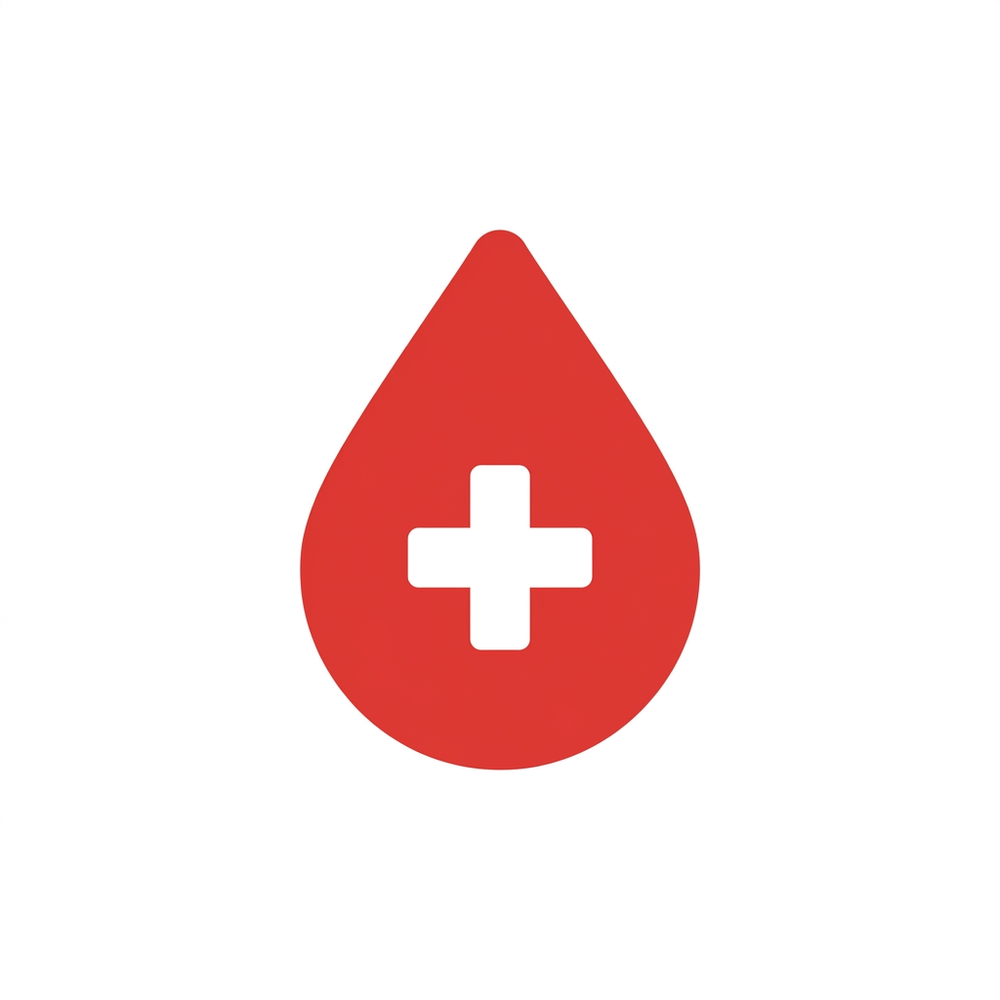

<div align="center">



# 🩸 Blood Donation Smart Platform

**A modern, full-featured mobile application for connecting blood donors with patients in need**

[](https://flutter.dev)
[](https://dart.dev)
[](https://pub.dev/packages/provider)
[](LICENSE)

*Graduation Project — October 6 University*

[Features](#-features) • [Screenshots](#-screenshots) • [Tech Stack](#-tech-stack) • [Architecture](#-architecture) • [Setup](#-getting-started) • [API](#-api-integration)

</div>

---

## 📖 Overview

The **Blood Donation Smart Platform** is a cross-platform mobile application built with Flutter that bridges the gap between blood donors and patients who urgently need blood. The platform enables real-time blood request posting, intelligent donor matching, QR-based donation confirmation, and a rewards system to incentivize regular donation.

The app connects to a live ASP.NET backend API and is designed with production-quality architecture, clean code separation, and a polished user experience.

---

## ✨ Features

### 🔐 Authentication
- Secure JWT-based login and registration
- Silent token refresh on expiry (15-minute access tokens)
- Forgot password with email-based reset token flow
- Persistent sessions via SharedPreferences

### 🎉 Onboarding
- Beautiful 4-page animated onboarding (shown once on first install)
- Page indicator dots, Skip/Next/Get Started controls
- Smooth fade + slide animations per page

### 🏠 Home Dashboard
- Personalized welcome banner with first name
- Live donation count and points stats from API
- Urgent blood requests section (top 3)
- "View All" seamlessly switches to the Requests tab
- One-tap "Ready to Donate?" CTA with 5-step eligibility check

### 📋 Blood Requests
- Browse real-time blood requests with AI-powered matching
- Search by hospital name or location (600ms debounce)
- Filter by urgency (Emergency / Normal)
- Detailed request view with donor acceptance flow
- Create new blood requests with map-based location picker

### 🩸 Donations
- Guided 5-step eligibility check before donating
- QR code generation for hospital confirmation
- Live countdown timer on QR codes (UTC-aware)
- Donation history with status tracking
- Cancel pending donations
- Re-open QR from donation history at any time

### 🎁 Rewards
- Points earned per confirmed donation
- Redeem points for healthcare rewards (medical checkups, pharmacy discounts, blood tests, etc.)
- Unique themed images per reward type with automatic fallback
- QR code generation for reward redemption at hospital
- Redemption history with Unused/Used status
- Reward description loaded on demand from API

### 👤 Profile
- Full profile management (name, phone, age, address)
- Change password
- Donation history with show more/less
- Request history with live status updates
- Blood pickup QR scanner for requesters
- Logout with token cleanup

### 📡 QR Code System
Three distinct QR workflows:
| QR Type | Who Uses It | Purpose |
|---|---|---|
| Donation QR | Donor shows → Hospital scans | Confirm blood donation |
| Pickup Scan | Requester scans | Confirm blood received |
| Reward QR | User shows → Hospital scans | Redeem reward |

---

## 📱 Screenshots

> *Screenshots coming soon — add your device screenshots here*

| Onboarding | Home | Requests | Profile |
|:---:|:---:|:---:|:---:|
|  |  |  |  |

| Rewards | Donation QR | Reward QR | Request Details |
|:---:|:---:|:---:|:---:|
|  |  |  |  |

---

## 🛠 Tech Stack

### Core
| Technology | Version | Purpose |
|---|---|---|
| **Flutter** | 3.x | Cross-platform UI framework |
| **Dart** | 3.x | Programming language |
| **Provider** | ^6.1.1 | State management |
| **HTTP** | ^1.2.2 | API communication |

### UI & UX
| Package | Version | Purpose |
|---|---|---|
| `google_fonts` | ^6.2.1 | Typography |
| `qr_flutter` | ^4.1.0 | QR code display |
| `mobile_scanner` | ^7.0.0 | QR code scanning |
| `flutter_map` | ^7.0.2 | Map location picker |
| `flutter_native_splash` | ^2.4.7 | Native splash screen |

### Data & Storage
| Package | Version | Purpose |
|---|---|---|
| `shared_preferences` | ^2.3.2 | JWT token persistence, onboarding flag |
| `intl` | ^0.18.1 | Date/time formatting |

### Location
| Package | Version | Purpose |
|---|---|---|
| `geolocator` | ^13.0.1 | GPS coordinates |
| `geocoding` | ^3.0.0 | Address from coordinates |
| `latlong2` | ^0.9.1 | Map coordinate model |

---

## 🏗 Architecture

The project follows **Clean Architecture** with a feature-first folder structure:

```
lib/
├── core/                          # Shared infrastructure
│   ├── network/
│   │   ├── api_client.dart        # HTTP client + auto JWT refresh
│   │   ├── api_endpoints.dart     # All API endpoint constants
│   │   ├── api_enums.dart         # BloodType & Gender enums
│   │   └── api_result.dart        # Sealed ApiSuccess / ApiFailure
│   ├── services/
│   │   └── token_storage.dart     # JWT persistence singleton
│   ├── theme/
│   │   └── app_theme.dart         # Colors, ThemeData
│   ├── utils/                     # Validators, formatters, constants
│   └── widgets/                   # Shared UI components
│
└── features/                      # Feature modules
    ├── auth/                      # Login, register, onboarding
    ├── home/                      # Dashboard, eligibility, urgent requests
    ├── requests/                  # Blood request CRUD + map
    ├── donations/                 # Donation flow + QR
    ├── profile/                   # User profile + histories
    ├── rewards/                   # Points system + reward QR
    └── chat/                      # AI chatbot assistant
```

Each feature module is structured as:
```
feature/
├── data/
│   ├── datasources/    # API calls (RemoteDataSource)
│   ├── models/         # JSON ↔ Dart models
│   └── repositories/  # ApiResult<T> wrappers
└── presentation/
    ├── providers/      # ChangeNotifier state classes
    ├── screens/        # Full-screen widgets
    └── widgets/        # Feature-specific UI components
```

### State Management Flow
```
UI Widget → Provider.read/watch → ChangeNotifier
                                      ↓
                               Repository (ApiResult)
                                      ↓
                              RemoteDataSource (HTTP)
                                      ↓
                              ASP.NET REST API
```

For the full architecture deep-dive, see [`docs/ARCHITECTURE.md`](docs/ARCHITECTURE.md).

---

## 🚀 Getting Started

### Prerequisites

- Flutter SDK ≥ 3.0.0
- Dart SDK ≥ 3.0.0
- Android Studio / VS Code with Flutter extension
- Android SDK (for Android) or Xcode (for iOS)

### Installation

**1. Clone the repository**
```bash
git clone https://github.com/fadyeshak1/blood_donation.git
cd blood_donation
```

**2. Install dependencies**
```bash
flutter pub get
```

**3. Generate the native splash screen**
```bash
dart run flutter_native_splash:create
```

**4. Add reward images**

Place your reward images in `assets/images/rewards/`:
```
assets/images/rewards/
├── medical_checkup.png
├── pharmacy_discount.png
├── blood_test.png
├── hospital_priority.png
└── health_package.png
```

**5. Run the app**
```bash
# Debug mode
flutter run

# Release mode
flutter run --release
```

### Build

```bash
# Android APK
flutter build apk --release

# Android App Bundle (for Play Store)
flutter build appbundle --release

# iOS (macOS required)
flutter build ios --release
```

For detailed setup instructions, environment configuration, and troubleshooting, see [`docs/SETUP.md`](docs/SETUP.md).

---

## 🌐 API Integration

The app connects to a live ASP.NET REST API:

**Base URL:** `https://blooddonationsys.runasp.net`

### Key Endpoint Groups

| Group | Base Path | Description |
|---|---|---|
| Auth | `/api/auth/` | Login, register, token refresh, password reset |
| User | `/api/users/` | Profile, dashboard, rewards history |
| Requests | `/api/requests/` | Blood request CRUD, pickup scan |
| Donations | `/api/donations/` | Create donation, QR generation, cancellation |
| Rewards | `/api/rewards/` | List rewards, redeem, QR generation |
| AI Matching | `/api/ai/` | Smart donor-request matching |
| Hospitals | `/api/hospitals/` | Hospital dropdown |

### Authentication

All API calls (except login/register/forgot-password) require a Bearer token:
```
Authorization: Bearer <access_token>
```

Access tokens expire after **15 minutes**. The app automatically refreshes them on every 401 response without requiring the user to log in again.

For the complete API reference with request/response shapes, see [`docs/API_REFERENCE.md`](docs/API_REFERENCE.md).

---

## 🎨 Design System

### Color Palette

| Color | Hex | Usage |
|---|---|---|
| 🔴 Red | `#F72530` | Primary actions, blood theme |
| 🔵 Blue | `#2475FF` | Navigation, secondary actions |
| 🟢 Green | `#32CD32` | Success, eligible, confirmed |
| 🟣 Purple | `#9370DB` | Points, rewards |
| ⚫ Black | `#060E1E` | Text, headings |
| ⚪ White | `#FFFFFF` | Backgrounds, cards |
| 🔘 Grey | `#C8C9CB` | Disabled, placeholder |

### Design Principles
- **Consistency** — Same button styles, card shapes, and spacing throughout
- **Accessibility** — Sufficient color contrast, clear iconography
- **Feedback** — Loading states, error views, success toasts on every action
- **Branding** — Blood drop logo used consistently across native splash, Flutter splash, and login screens

---

## 🤝 Contributing

Contributions, bug reports, and feature requests are welcome. Please read [`CONTRIBUTING.md`](CONTRIBUTING.md) before submitting a pull request.

---

## 📝 Changelog

See [`CHANGELOG.md`](CHANGELOG.md) for a full history of changes.

---

## 🔧 Troubleshooting

For common issues and their solutions, see [`docs/TROUBLESHOOTING.md`](docs/TROUBLESHOOTING.md).

---

## 📄 Documentation Index

| File | Description |
|---|---|
| [`CONTRIBUTING.md`](CONTRIBUTING.md) | How to contribute to this project |
| [`CHANGELOG.md`](CHANGELOG.md) | Version history and release notes |
| [`docs/ARCHITECTURE.md`](docs/ARCHITECTURE.md) | Deep-dive into architecture decisions |
| [`docs/API_REFERENCE.md`](docs/API_REFERENCE.md) | Complete API endpoint reference |
| [`docs/SETUP.md`](docs/SETUP.md) | Detailed environment setup guide |
| [`docs/TROUBLESHOOTING.md`](docs/TROUBLESHOOTING.md) | Common issues and fixes |

---

## 📜 License

This project is licensed under the MIT License — see the [LICENSE](LICENSE) file for details.

---

<div align="center">

Made with ❤️ for October 6 University Graduation Project

**[⬆ Back to top](#-blood-donation-smart-platform)**

</div>